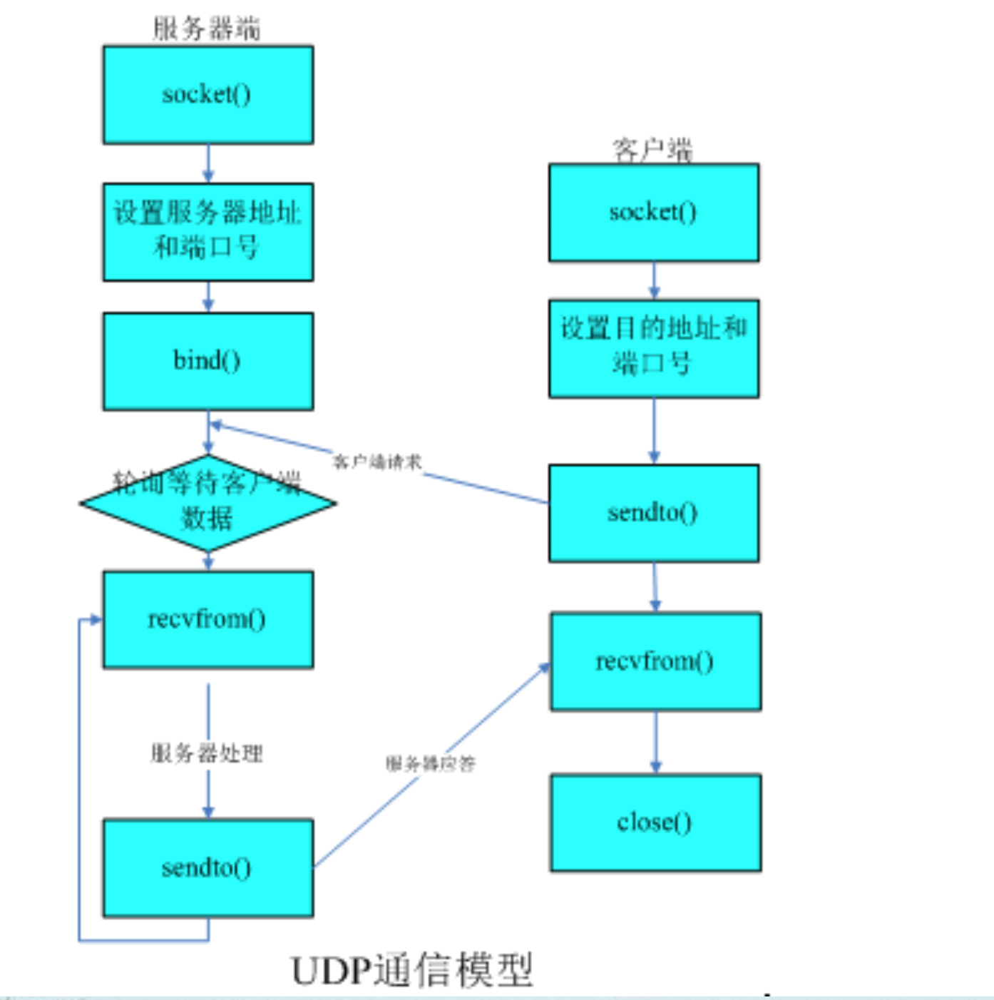
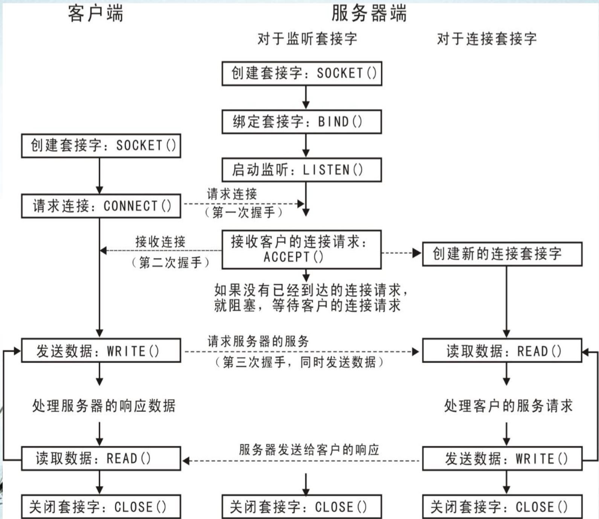

## 第1节课
### 进程和线程的基本概念
进程是处于运行过程中的程序实例,是操作系统调度和分配资源的基本单位。  
一个进程实体由程序代码、数据和进程控制块三部分构成。  
各种计算机应用程序在运行时,都以进程的形式存在。 
每个进程都至少拥有一个线程，当创建一个进程时,系统会自动创建它的第一个线程,称为主线 程。然后,该线程可以创建其他的线程,而这些线程又能创建更 多的线程。

### 网络应用进程在网络体系结构中的位置 
从计算机网络体系结构的角度来看,网络应用进程处于网络层次结构的最上层。  

从功能上,可以将网络应用程序分为两部分: 
一部分是专门负责网络通信的模块,它们与网络协议栈相连接,借助网络协议栈提供的服务完成网络上数据信息的交换。  
另一部分是面向用户或者作其他处理的模块,它们接收用户的命令,或者对借助网络传输过来的数据进行加工,这两部分模块相互配合,来实现网络应用程序的功能。

### 端口的概念

端口是TCP/IP协议族中,应用层进程与传输层协议实体间的通信接口。  
类似于文件描述符,每个端口都拥有一个叫作端口号(port number)的整数型标识符。 

### 进程的网络地址的概念
在因特网络中, 用一个三元组可以在全局中唯一地标识一个应用层进程:   
应用层进程地址=(传输层协议, 主机的IP地址, 传输层的端口号)  
这样一个三元组, 叫做一个半相关(half-association), 它标识了因特网中, 进程间通信的一个端点, 也把它称为进程的网络地址。

### 网络中进程通信的标识
一个完整的网间通信需要一个五元组在全局中唯一地来标识:  
(传输层协议, 本地机IP地址, 本地机传输层端口, 远地机IP地址, 远地机传输层端口)  
这个五元组称为一个全相关(association)。即两个协议相同的半相关才能组合成一个合适的全相关, 或完全指定一对网间通信的进程。

## 第2节课
套接字应用程序编程接口是网络应用程序通过网络协议栈进行通信时所使用的接口,即应用程序与协议栈软件之间的接口,简称套接字编程接口(Socket API)。   
它定义了应用程序与协议栈软件进行交互时可以使用的一组操作,决定了应用程序使用协议栈的方式、应用程序所能实现的功能、以及开发具有这些功能的程序的难度。

###  2.套接字具有三种类型
1. 数据报套接字(Datagram SOCKET) UDP  
数据报套接字 供无连接的不保证可靠的独立的数据报传输服务。在Internet通信域中,数据报套接字使用UDP数据报协议形成的进程间通路,具有UDP协议为上层所供的服务的所有特点。

2. 流式套接字(Stream SOCKET) TCP   
流式套接字提供双向的、有序的、无重复的、无记录边界的可靠的数据流传输服务。在Internet通信域中,流式套接字使用TCP协议形成的进程间通路, 具有TCP协议为上层所提供的服务的所有特点,在使用流式套接字传输数据之前,必须在数据的发送端和接收端之间建立连接

3. 原始式套接字(RAW SOCKET) 
原始式套接字允许对较低层次的协议, 如IP、ICMP直接访问,用于检验新的协议的实现。

### 本机字节顺序和网络字节顺序
在具体计算机中的多字节数据的存储顺序, 称为本机字节顺序。   
多字节数据在网络协议报头中的存储顺序, 称为网络字节顺序。    

网络应用程序要在不同的计算机中运行, 本机字节顺序是不同的, 但是,网络字节顺序是一定的。  
所以,应用程序在编程的时候,在把IP地址和端口号装入套接字的时候,应当把它们从本机字节顺序转换为网络字节顺序;相反,在本机输出时,应将它们从网络字节顺序转换为本机字节顺序。

## 第3节课

### 什么是阻塞 ∆
阻塞是指一个进程执行了一个函数或者系统调用, 该函数由于某种原因不能立即完成, 因而不能返回调用它的进程, 导致进程受控于这个函数而处于等待的状态, 进程的这种状态称为阻塞。

### ICMP
ICMP是(Internet Control Message Protocol)Internet控制报文协议。它是TCP/IP协议族的一个子协议,用于在IP主机、路由器之间传递控制消息。控制消息是指网络通不通、主机是否可达、 路由是否可用等网络本身的消息。这些控制消息虽然并不传输用户数据,但是对于用户数据的传递起着重要的作用。

ICMP包有一个8字节长的包头,其中前4个字节是固定的格式, 包含8位类型字段,8位代码字段和16位的校验和;后4个字节根据 ICMP包的类型而取不同的值。

	// 0                   1                   2                   3
	// 0 1 2 3 4 5 6 7 8 9 0 1 2 3 4 5 6 7 8 9 0 1 2 3 4 5 6 7 8 9 0 1
	// +-+-+-+-+-+-+-+-+-+-+-+-+-+-+-+-+-+-+-+-+-+-+-+-+-+-+-+-+-+-+-+-+
	// |     Type      |      Code     |          Checksum             |
	// +-+-+-+-+-+-+-+-+-+-+-+-+-+-+-+-+-+-+-+-+-+-+-+-+-+-+-+-+-+-+-+-+
	// |                             data                              |
	// +-+-+-+-+-+-+-+-+-+-+-+-+-+-+-+-+-+-+-+-+-+-+-+-+-+-+-+-+-+-+-+-+
	Type 类型
	Code 代码字段
	Checksum 校验和
	data 更具不同的类型而取不同的值

## 第4次课
### TCP通信的基本步骤如下: 
服务端:  

	socket---bind---listen---while(True){---accept-- -recv---send----}---close

客户端:

	socket-----connect---send---recv-------close
	
	
### UDP通信的基本步骤如下:   
服务端:

	socket---bind-----recvfrom---sendto----------close

客户端:

	socket---------------sendto------recvfrom-------close
	

## 第5次课
### UDP协议
UDP是User Datagram Protocol的简称,中文名是用户数据报协议,是OSI(Open System Interconnection, 开放式系统互联)参考模型中一种无连接的传输层协议,提供面向事务的简单不可靠信息传送服务。UDP在IP报文的协议号是17。

* User Datagram Protocol
* 无连接的传输层协议
* 简单不可靠信息传送服务
* 在第四层——传输层,处于IP协议的上一层。
* 不提供数据包分组、组装和不能对数据包进行排序的缺点

#### 特点
* UDP是一个无连接协议，传输数据之前源端和终端不建立连接
*  由于传输数据不建立连接，因此也就不需要维护连接状态,包括收发状态等,因此一台服务机可同时向多个客户机传输相同的消息
*  UDP信息包的头很短
*  吞吐量不受拥挤控制算法的调节，只受应用软件生成数据的速率、传输带宽、源端和终端主机性能的限制。
*   UDP使用尽最大努力交付
*   UDP是面向报文的

## 第6次课
### 什么是进程
计算机程序只是磁盘中可执行的二进制的数据。它们只有在被读取到内存中,被操作系统调用的时候才开始它们的生命期。  
进程(有时被称为重量级进程)是程序的一次执行。 每个进程都有自己的地址空间、内存、数据栈及其他记录其运行轨迹的辅助数据。  
使用进程间通讯(interprocess communication, IPC),而不能直接共享信息。

### 什么是线程
所有的线程(有时被称为轻量级进程)运行在同一进程中,共享相同的运行环境。  
线程有开始,顺序执行和结束三个部分。它有一个自己的指令指针,记录自己运行到什么地步。  
线程的运行可能被抢占(中断);或暂时的被挂起(也叫睡眠);让其他的线程运行(这叫让步)。  
在进程的整个运行过程中,每个线程只做自己的事情,在需要的时候跟其他的线程共享运行的结果。

#### Python 线程的弊端
多核CPU并不能充分利用多核资源  
GIL的存在导致每个单独线程都会在竞争到GIL后才运行

## 第7次课
### TCP 协议
传输控制协议 (Transmission Control Protocol,TCP)提供一个面向连接的、端到端的、 完全可靠的(无差错、无丢失、无重复或失序) 全双工的流传输服务。

* TCP是面向连接的传输层协议。 
* 面向字节流。
* TCP提供可靠交付的服务。

#### 可靠性保证
* 每个信息包都包含一个校验码
* 了防止信息包丢失,TCP会要求接收方每收到一个信息包都反馈一下
* 为了防止信息包重复或顺序错误TCP每传送一个信息包都会传送一个序号

## 第8次课

## 第9次课
### http https 区别
1. http是超文本传输协议，信息是明文传输， https 则是具有安全性的 ssl 加密传输协议。
2. http和https使用的是完全不同的连接方式，用的端口也不一样,前者是80,后者是443。
3. http的连接很简单,而无状态的https协议是由ssl+http协议构建的可进行加密传输、身份认证的网络协议，要比http协议安全。



### httplib
	conn1 = HTTPConnection('www.baidu.com:80')   
	conn2 = HTTPConnection('www.baidu.com',80)  
	conn3 = HTTPConnection('www.baidu.com',80,True,10)   
	错误实例:  
	conn3 = HTTPConnection('www.baidu.com:80',True,10)  
	返回: HTTPConnection类会实例并返回一个HTTPConnection
	
	
	conn3 = HTTPSConnection('accounts.google.com',443,key_file, cert_file,True,10)
	
	原型:  
	conn.request(method, url[, body[, headers]])  
	实例:
	conn.request(‘get', '/', '', {'user-agent':'test'})

-----

	import httplib
	conn = httplib.HTTPCOnnection("www.baidu.com")
	conn.request("HEAD", "/index.html")
	res = conn.getreponse()
	print res.status, res.reason
	data = res.read()

------
	
	import httplib
	conn = httplib.HTTPConnection("www.163.com")
	conn.putrequest("GET", '/index.html')
	conn.putrequest("Accept", "text/html")
	conn.endheaders()
	ret = conn.getreponse()
	ret.status
	data = ret.read()

## 第10次课
## 第11次课

## 第12次课
python自带的包建立简单的web服务器
 
* BaseHTTPServer
* SimpleHTTPServer
* CGIHTTPServer

Python开源的web框架简介

* Zope 2
* Web.py
* Pyramid
* Django
* CubicWeb
* Web2py

* Flask

## 第13次课

## 第14/15次课
### FTP 模式
FTP支持两种模式:

* Standard (PORT方式,主动方式)
* Passive (PASV,被动方式)。

#### Port模式 Standard 主动方式
FTP 客户端首先和服务器的 TCP 21端口建立连接, 用来发送命令, 客户端需要接收数据的时候在这个 通道上发送PORT命令。PORT命令包含了客户端用什么端口接收数据。在传送数据的时候, 服务器端通过自己的 TCP 20 端口连接至客户端的指定端口发送数据。FTP server 必须和客户端建立一个新的连接用来传送数据。

#### Passive模式 Passive 被动方式
建立控制通道和 Standard 模式类似, 但建立连接后发送 Pasv 命令。服务器收到 Pasv 命令后,打开一个临时端口(端口号大于1023小于65535)并且通知客户端在这个端口上传送数据的请求 ,客户端连接 FTP 服务器此端口, 然后 FTP 服务器将通过这个端口传送数据。

### http 与 ftp 区别：
1. HTTP中的压缩算法：HTTP提供了一个在一些压缩算法中客户端和服务器共同协商选择的办法。其中gzip可以说是最有影响力的一种，而FTP中并不存在这种复杂的算法。
2. HTTP支持代理：HTTP一个很大的特点就是支持代理，这种功能是构建在协议里的，而FTP并不支持。
3. 而FTP也能脱颖而出的一点是这个协议是直接面向文件级别的。这以为着FTP有例如可以通过命令列出远程服务器上的目录列表，而HTTP没有这个概念。


### http 与 ftp 区别：
1. HTTP协议是用来浏览网站的,而FTP是用来访问和传输文件的,FTP文件传输有点批量上传和维护网站的意思 ,而HTTP文件传输更多的是为终端用户提供文件传输,比 如电影、图片、音乐之类。
2. HTTP 和 FTP 客户端:通常的HTTP客户端就是浏览器,而FTP服务可以通过命令行或者用户自有的图形界面客户端。
3. HTTP 头: HTTP 头包含了 metadata ,比如说最后更改的日期、编码方式、服务器名称版本还有其他的一些信息,而这些在FTP中是不存在的。
4. FTP要比HTTP早出现10年左右。
5. 数据格式:FTP能传输ACSII数据或者二进制格式的数据,而HTTP只用二进制格式。
6. HTTP中的流水线:HTTP支持流水线,这就意味着客户端可以在上一个请求处理完之前,发出下一个请求,其结果就是多次请求数据之前省掉了部分服务器客户端往返时延。而FTP并没有这项支持。
7. HTTP中的动态端口:FTP一个最大的问题就是它使用两个连接,第一个连接用来发送控制指令,当接受或者发送数据的时候,又打开第二个TCP连接。而HTTP在双向传输中使用动态端口
8. HTTP中的持久连接:对一个HTTP会话来讲,客户端可以维护一个单个的连接并使用它进行任意数量的数据传输。FTP每次有数据的需要时都创建一个新的连接。重复的创建新的连接带来的体验并不好,因为每次创建连接都必须让双方握手验证,这消耗了很多时间。
9. HTTP中的压缩算法:HTTP提供了一个在一些压缩算法中客户端和服务器共同协商选择的办法。其中 gzip 可以说是最有影响力的一种,而FTP中并不存在这种复杂的算法。
10. HTTP支持代理:HTTP一个很大的特点就是支持代理,这种功能是构建在协议里的,而FTP并不支持。
11. 而FTP也能脱颖而出的一点是这个协议是直接面向文件级别的。这以为着FTP有例如可以通过命令列出远程服务器上的目录列表,而HTTP没有这个概念。